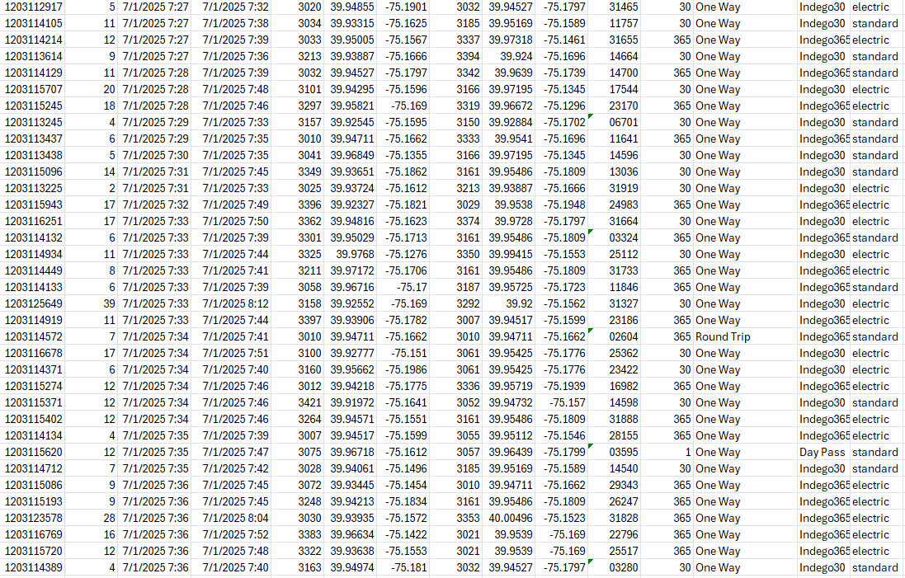
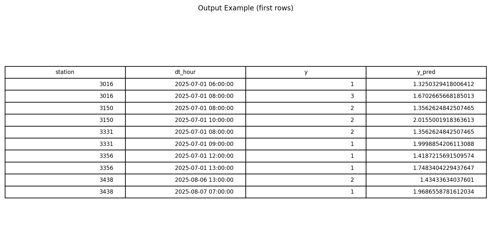

# Bike-Demand-Philly
## Overview
Bike-share systems such as Philadelphia’s Indego rely on accurate demand forecasting to ensure that bikes and docks are optimally distributed across the network. If operators can anticipate demand surges at specific stations, they can proactively redistribute bikes and prevent shortages.

This project aims to predict the number of bike rentals at each Indego station in the next hour based on temporal, spatial, and environmental factors. The goal is to develop a machine learning model that provides short-term demand forecasts to improve operational efficiency and user satisfaction.

### Authors
*[Rui Jiang](https://rumron.github.io/)
*[LinkedIn](https://www.linkedin.com/in/rui21/)
### Example Input and Output
| Input | Output |
|----------------------------|---------------------------|
| |  |

*[bike Indego data](https://www.rideindego.com/about/data/)
